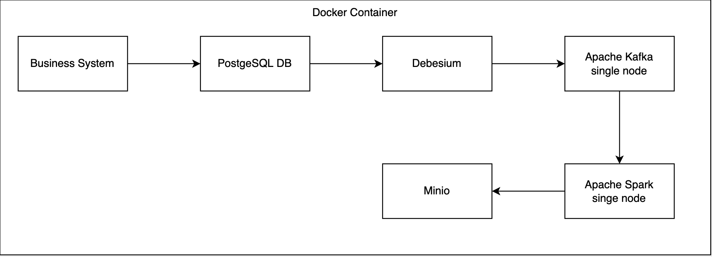

#Mini Data Platform in Docker Containers – Semester Project#

##Objective##
Develop a mini data platform using Docker containers that simulates a business process, ingests data into PostgreSQL, captures changes with Debezium, streams data through Kafka, processes it in Spark and stores it in MinIO in Delta format.

